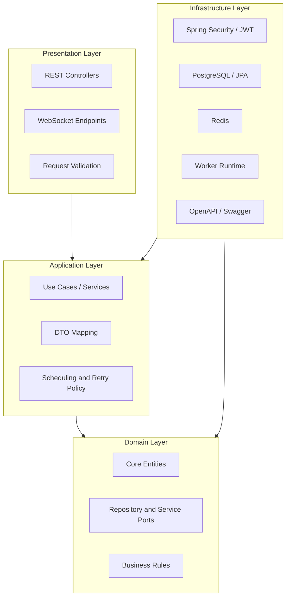
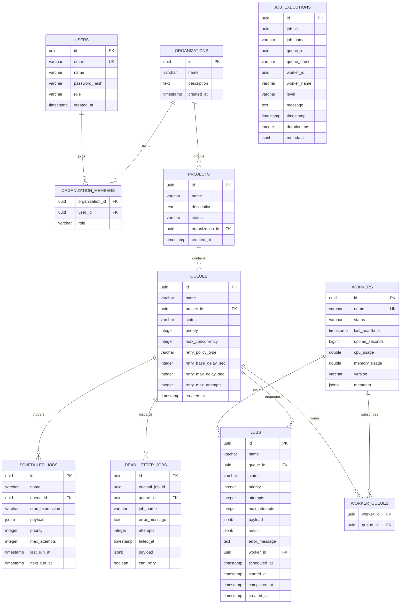
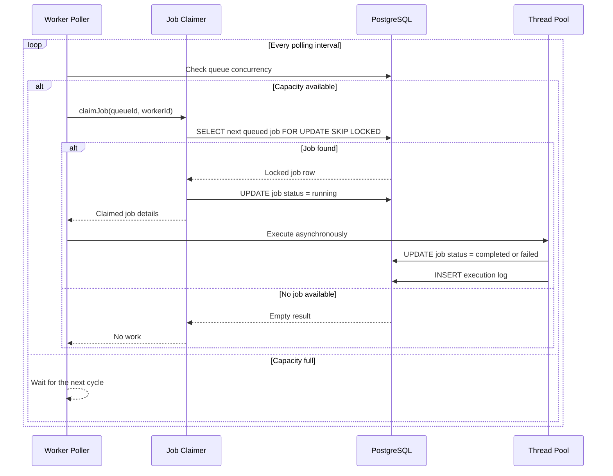

# Cronix Distributed Job Scheduler

Cronix is a distributed job scheduling platform for teams that need reliable background execution, queue orchestration, and live operational visibility. It is designed to coordinate work across multiple worker nodes while keeping the scheduling layer deterministic, the execution layer resilient, and the operator experience clear.

The application is built as a full monorepo with a Spring Boot backend, a React + TypeScript frontend, PostgreSQL for durable state, Redis for fast coordination and caching, and a real-time dashboard that surfaces queue health, worker status, job execution history, and scheduling activity.

The product emphasis is not only on running jobs, but on making the system understandable while it runs. That is why the UI, APIs, and backend model are documented and structured around operational concerns such as ownership, concurrency, retries, claiming, heartbeat monitoring, and telemetry.

## Overview

Cronix is intended to behave like a control plane for background work. At a high level, it provides:

1. Job creation and scheduling across queues.
2. Worker registration and lifecycle tracking.
3. Queue-level concurrency control.
4. Retry handling and dead-letter visibility.
5. Organization and project isolation for multi-tenant usage.
6. Live telemetry for operations teams and developers.

The system is split so that business behavior is separated from framework concerns. The backend owns the source of truth for jobs, queues, projects, workers, and execution logs. The frontend consumes that data to present a dashboard that is intentionally information-dense and suitable for real-time monitoring.

## Key Capabilities

Cronix is organized around the operational needs of a distributed scheduler rather than a single-process queue.

### Scheduling and Execution

Jobs can be queued, executed, retried, and observed across worker nodes. The system is structured to support a claim-and-run model where a worker atomically reserves a job, marks it as running, and then completes or fails it independently of the claim transaction.

### Queue Management

Queues are first-class entities. They allow the platform to apply per-queue concurrency limits, priority rules, retry settings, and routing decisions. This makes it possible to isolate sensitive or high-priority workloads from bulk background processing.

### Worker Health

Workers send heartbeat-style operational data so the platform can determine whether nodes are alive, idle, overloaded, or disconnected. The dashboard can surface this information in real time for operators.

### Multi-Tenant Structure

Organizations, users, projects, and memberships are modeled explicitly. That means the platform can support access boundaries and role-based behavior instead of treating all work as a single flat queue.

### Observability

Execution events, queue status, worker metrics, and job history are surfaced through the API and presented in the UI so the scheduler can be monitored without needing direct database access.

## Architecture

Cronix follows a clean, layered architecture that keeps the application easy to reason about as it grows.



### Layer Responsibilities

#### Presentation Layer

This layer handles the external interface of the system. It accepts HTTP requests, validates payloads, serializes responses, and exposes real-time endpoints where needed. The goal is to keep transport concerns out of the core business flow.

#### Application Layer

This layer contains use cases and orchestration logic. It coordinates job submission, queue operations, user flows, retries, and execution workflows while keeping the transaction boundaries and business sequencing explicit.

#### Domain Layer

This is the core of the system. It contains the entities and rules that define how Cronix works: jobs, queues, workers, organizations, projects, memberships, and execution records. It should remain as framework-independent as practical.

#### Infrastructure Layer

This layer integrates the system with Spring Boot, PostgreSQL, Redis, JWT authentication, WebSocket transport, and any runtime-specific concerns. It is where implementation details live, but not the business rules themselves.

## Domain Model

The domain model is centered on the concepts that make a distributed scheduler manageable in production.

### Organizations and Users

Organizations represent top-level tenant boundaries. Users belong to organizations through membership records and can carry roles that define what they are allowed to see or modify.

### Projects

Projects group queues and workload definitions. They help organize jobs by product area, environment, or business function.

### Queues

Queues are the execution backbone. They define priority, concurrency, and retry behavior. A queue determines how jobs are admitted to workers and how aggressively they can run in parallel.

### Jobs

Jobs are the units of work. Each job tracks status, attempts, timing data, payload data, result data, error information, and the worker that claimed it.

### Scheduled Jobs

Scheduled jobs represent recurring or delayed work. They store cron-style scheduling data, payloads, and next-run metadata so the scheduler can materialize future executions.

### Dead Letter Jobs

Dead-letter records preserve failed jobs that can no longer be retried. They provide a safety net for diagnosing failures and deciding whether a failed workload should be reprocessed.

### Workers

Workers are execution nodes. Their status, heartbeat, runtime metrics, version, and metadata are tracked so the platform knows which nodes are healthy and which are available.

### Job Executions

Execution records provide an audit trail of what ran, when it ran, where it ran, and what the outcome was. They are useful for debugging, reporting, and operational review.

## Database Design

Cronix uses PostgreSQL as the durable source of truth. The schema is designed to support relational integrity, fast lookup, and operational auditing.



### Why the Schema is Structured This Way

The database schema is intentionally normalized around the scheduler lifecycle.

1. Organizational data is separated from runtime execution data so tenant boundaries remain clear.
2. Queue metadata is stored independently so concurrency and retry policies can be tuned without changing job records.
3. Job execution history is retained separately from job state so the platform can keep a durable audit trail.
4. Worker state is tracked in a dedicated table to make health checks and routing decisions straightforward.
5. Dead-letter data is preserved instead of being discarded so operators can diagnose failure patterns.

## Distributed Claiming and Concurrency

One of the most important parts of Cronix is how it prevents multiple workers from claiming the same job.

The system uses PostgreSQL row locking with `FOR UPDATE SKIP LOCKED` so workers can safely poll a queue without blocking each other. A worker claims a job inside a short transaction, marks it as running, and then releases the lock immediately so the actual execution can proceed asynchronously.



### Benefits of This Model

This approach gives Cronix several practical advantages:

1. It avoids an external distributed lock service for the hot path of job claiming.
2. It keeps the lock duration very short, which reduces contention.
3. It allows multiple workers to poll the same queue safely.
4. It scales better than a naive single-node scheduler because the claim operation remains atomic.
5. It keeps execution separate from reservation so a slow job does not block the next claim cycle.

## Frontend Design System

The frontend is built as an operational dashboard rather than a generic admin panel. The design language is intentionally tactile and high-contrast, with soft surfaces and strong data presentation.

### Visual Direction

The current UI uses a neumorphic and soft-surface aesthetic. Cards, panels, and metric blocks are styled to feel elevated from the background while still retaining a calm and controlled look.

### UI Behavior

The interface is organized around:

1. Summary cards for quick status scanning.
2. Charts for queue and job trend analysis.
3. Tables and lists for detailed operational inspection.
4. Status chips and visual indicators for runtime state.
5. Dialogs and confirmation flows for destructive or important actions.

### Frontend Stack

The frontend uses a modern React toolchain with composable UI primitives.

1. React 18 with TypeScript for component structure and safety.
2. Vite for fast local development and optimized builds.
3. Tailwind CSS for utility-driven styling and layout composition.
4. Radix UI primitives for accessible interactive components.
5. TanStack Query for client-side caching, polling, and server-state orchestration.
6. Recharts for charting and telemetry visualization.
7. Framer Motion for motion design and state transitions.
8. Lucide React for icons.
9. React Hook Form and Zod for validated form flows.

## Backend Stack

The backend is a Spring Boot service with the responsibilities you would expect from a scheduler control plane.

### Runtime and Frameworks

1. Java 23 for the application runtime.
2. Spring Boot 3.3.1 for the service foundation.
3. Spring Web for REST APIs.
4. Spring Validation for request validation.
5. Spring WebSocket for live transport.
6. Spring Security for authentication and authorization.
7. Spring Data JPA for persistence.
8. PostgreSQL as the primary database.
9. Redis for caching and coordination.
10. MapStruct for DTO mapping.
11. Lombok for concise domain and boilerplate support.
12. SpringDoc OpenAPI for API documentation.
13. JJWT for token handling.

### Backend Concerns

The backend is responsible for:

1. Authentication and authorization.
2. Queue and job lifecycle management.
3. Worker registration and status tracking.
4. Scheduled job orchestration.
5. Retry handling and dead-letter routing.
6. Execution logging and telemetry generation.
7. Real-time updates to the frontend.

## Repository Structure

The repository is organized as a monorepo with a small root runner and two application packages.

1. `backend/` contains the Spring Boot application, its domain code, and test sources.
2. `frontend/` contains the React dashboard, UI components, routes, and client services.
3. `database/` contains the schema bootstrap script used to initialize PostgreSQL.
4. `docs/` contains long-form architecture and design documentation.
5. `docker/` contains container-related deployment assets.

### Frontend Source Layout

The frontend source tree is divided by responsibility:

1. `components/` contains reusable UI building blocks and chart widgets.
2. `context/` contains global context providers such as authentication.
3. `hooks/` contains shared React hooks and API helpers.
4. `pages/` contains route-level screens.
5. `routes/` contains router configuration.
6. `services/` contains API integration and mock data.
7. `types/` contains shared TypeScript types.

### Backend Source Layout

The backend uses the standard Maven source layout:

1. `src/main/java` contains the application code.
2. `src/main/resources` contains runtime configuration.
3. `src/test/java` contains automated tests.

## API Documentation

Cronix exposes a documented backend API intended to be consumed by the frontend dashboard and by future integrations.

The project includes OpenAPI / Swagger support so developers can inspect the surface area of the backend and test endpoints interactively while developing.

Typical API areas include:

1. Authentication and session handling.
2. Organization and project management.
3. Queue administration.
4. Job submission, inspection, and execution history.
5. Worker and health monitoring.
6. Metrics and operational reporting.

## Local Development

### Prerequisites

Before running the project locally, install or make available the following:

1. Node.js 18 or newer.
2. Java JDK 23 or compatible runtime for the backend.
3. PostgreSQL 16 or compatible.
4. Redis 7 or compatible.

### Run With One Command

From the repository root, run both the backend and frontend together:

```bash
npm run dev
```

This starts:

1. The frontend development server with hot module replacement.
2. The backend Spring Boot application.

### Service URLs

When running locally, the main entry points are typically:

1. Frontend dashboard: `http://localhost:5173/`
2. Backend API: `http://localhost:8080/api/v1/`
3. Swagger UI: `http://localhost:8080/swagger-ui.html`

## Docker Setup

Cronix also includes Docker-based composition for local infrastructure and deployment-style workflows.

The root `docker-compose.yml` wires together:

1. PostgreSQL for persistent storage.
2. Redis for coordination and cache state.
3. The backend service.
4. The frontend service.

This setup is useful when you want a reproducible environment that mirrors the production topology more closely than a manually started local stack.

### Docker Defaults

The compose file currently provisions default credentials and service names suitable for local development only. Those defaults should be replaced with secure values for any non-local environment.

## Demo Mode

The frontend includes a standalone demo mode so the dashboard can be explored without connecting to a fully populated backend or database.

### How to Use Demo Mode

1. Open the login page at `http://localhost:5173/login`.
2. Use the demo account helper to fill the form.
3. Submit the preloaded credentials:
   - Email: `demo@cronix.dev`
   - Password: `demo1234`
4. The dashboard loads representative scheduler data, charts, queue state, and worker metrics.

Demo mode is useful for presentations, UI review, and quick onboarding because it removes the need to seed a full backend environment before inspecting the product.

## Configuration Notes

The backend and frontend expect environment-specific configuration for database access, Redis access, authentication secrets, and runtime URLs. In practice, these values should be managed through environment variables or deployment configuration rather than hard-coded values.

## Troubleshooting

If the application does not start correctly, the most common checks are:

1. Confirm PostgreSQL is available and the schema has been initialized.
2. Confirm Redis is running if worker coordination depends on it.
3. Confirm the backend is listening on the expected port.
4. Confirm the frontend API base URL matches the backend address.
5. Verify that Java and Node versions match the project requirements.

If the UI loads but data is missing, the likely causes are a disconnected backend, empty seed data, or a mismatch in API environment settings.

## Summary

Cronix is a distributed scheduler built to show the full lifecycle of background execution: model the workload, route it safely, execute it across worker nodes, and expose the result through a clear operational dashboard. The architecture intentionally keeps the scheduling logic, persistence model, and user interface well separated so the system can scale without becoming difficult to understand.
# Cronix

