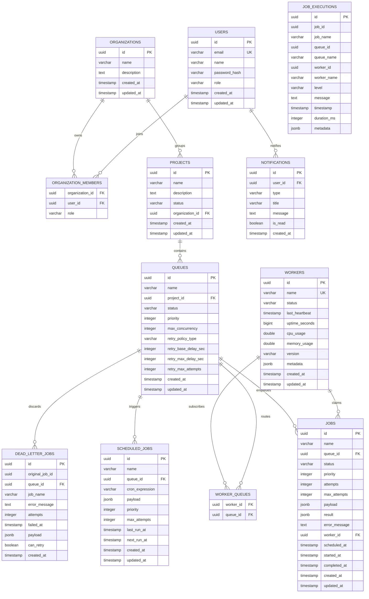

# Cronix Distributed Job Scheduler

<p align="center">
  
  
  
  
  
  
  
  
  
  
</p>

Cronix is an enterprise-grade, distributed job scheduling and queue orchestration platform. It is engineered for operations teams and developers who require highly reliable background execution, per-queue concurrency throttling, fine-grained retry topologies, and real-time operational visibility.

By decoupling the scheduling plane from worker runtimes, Cronix coordinates long-running and recurring workloads across multiple execution nodes. It maintains a deterministic scheduling layer, a resilient claim-and-run execution lifecycle, and an interactive dashboard focused on system health and live debugging.

---

## Table of Contents
1. [Key Capabilities](#key-capabilities)
2. [Clean Architecture Blueprint](#clean-architecture-blueprint)
3. [Database Schema & Design](#database-schema--design)
4. [Distributed Claiming & Concurrency Engine](#distributed-claiming--concurrency-engine)
5. [Tech Stack & Core Libraries](#tech-stack--core-libraries)
6. [Real-time STOMP Websocket Broadcasting](#real-time-stomp-websocket-broadcasting)
7. [Repository Layout](#repository-layout)
8. [REST API Endpoints Reference](#rest-api-endpoints-reference)
9. [Worker Node Configuration](#worker-node-configuration)
10. [Local Development & Setup](#local-development--setup)
11. [Docker Deployment](#docker-deployment)
12. [Frontend Demo Mode Sandbox](#frontend-demo-mode-sandbox)
13. [Troubleshooting Guide](#troubleshooting-guide)
14. [License](#license)

---

## Key Capabilities

*   **Atomic Claim-and-Run**: Uses row-level database locking to guarantee that exactly one worker claims a job run, releasing locks in less than a millisecond while execution continues asynchronously.
*   **Per-Queue Concurrency Controls**: Prevents resource starvation by enforcing strict execution limits at the queue level, allowing sensitive or critical jobs to be isolated from high-volume batch queues.
*   **Intelligent Retry Topologies**: Supports custom backoff policies (Fixed, Linear, Exponential) configured per queue. Jobs that exceed their max retry thresholds are safely dispatched to the Dead Letter Queue (DLQ).
*   **Multi-tenant Organization & Project Isolation**: Models top-level Organizations and sub-Projects explicitly, providing strict access boundaries and role-based access control (RBAC).
*   **Real-time Operations Dashboard**: Renders sub-second telemetry updates covering worker heartbeats, throughput trends, current queue depths, and live task executions.
*   **Audit-Ready Execution Logs**: Retains structural execution records separately from job states, generating a clean log database to analyze task run histories and error root-causes.

---

## Clean Architecture Blueprint

Cronix is built using **Hexagonal and Clean Architecture** patterns. This design enforces strict decoupling: business code has zero knowledge of database technologies, security frameworks, or transport layers.

```
       +--------------------------------------------------------+
       |                   Presentation Layer                   |
       |  (REST Controllers, DTO Mappers, STOMP WebSockets, GW) |
       +---------------------------v----------------------------+
                                   |
       +---------------------------v----------------------------+
       |                   Application Layer                    |
       |   (Use Cases, Transactional Services, Retry Engines)   |
       +---------------------------v----------------------------+
                                   |
       +---------------------------v----------------------------+
       |                      Domain Layer                      |
       |       (Pure Business Entities, Interface Ports)        |
       +---------------------------^----------------------------+
                                   |
       +---------------------------|----------------------------+
       |                 Infrastructure Layer                   |
       |  (Spring Data JPA, PostgreSQL, Redis Cache, Poller)    |
       +--------------------------------------------------------+
```

### Module Responsibilities

1.  **Domain Layer** ([com.cronix.backend.domain](file:///c:/Users/aayus/Desktop/Cronix/backend/src/main/java/com/cronix/backend/domain)):
    *   Contains pure business entities (e.g., `Job`, `Queue`, `Worker`, `ScheduledJob`).
    *   Maintains business validation rules.
    *   Has zero dependencies on external frameworks (e.g., Hibernate annotations or Spring annotations) to keep the core scheduler rules generic and testable.
2.  **Application Layer** ([com.cronix.backend.application](file:///c:/Users/aayus/Desktop/Cronix/backend/src/main/java/com/cronix/backend/application)):
    *   Defines use cases and orchestrates service pipelines.
    *   Contains transactional flow coordinators (e.g., `JobService`, `QueueService`, `RetryEngine`).
    *   Resolves retry logic and schedules recurring jobs.
3.  **Infrastructure Layer** ([com.cronix.backend.infrastructure](file:///c:/Users/aayus/Desktop/Cronix/backend/src/main/java/com/cronix/backend/infrastructure)):
    *   Integrates frameworks with core business logic.
    *   Handles database persistence via Spring Data JPA mappings to PostgreSQL.
    *   Implements caching and locks using Redis.
    *   Runs the background worker polling loops (`WorkerPoller`) and task executors.
4.  **Presentation Layer** ([com.cronix.backend.presentation](file:///c:/Users/aayus/Desktop/Cronix/backend/src/main/java/com/cronix/backend/presentation)):
    *   Exposes endpoints to external clients.
    *   Contains REST controllers, WebSocket brokers, request validation rules, and the `GlobalExceptionHandler` to translate backend exceptions into structured JSON responses.

---

## Database Schema & Design

Cronix uses PostgreSQL as its primary transactional storage system. The schema is optimized for low-latency job claiming and robust historical reporting.

### Entity Relationship Diagram (ERD)



### Table Details & Indexes

The complete SQL schema definition is maintained in [database/schema.sql](file:///c:/Users/aayus/Desktop/Cronix/database/schema.sql). The database features specialized indices to maximize throughput under high concurrent request loads:

*   `idx_jobs_status_queue_scheduled`: Crucial for polling. Indexes `(status, queue_id, scheduled_at)` to instantly fetch jobs matching execution bounds.
*   `idx_workers_last_heartbeat`: Tracks worker health and allows background cleanup routines to detect crashed nodes.
*   `idx_job_executions_timestamp`: Optimizes dashboard metric retrievals by indexing transaction logs in descending order.

---

## Distributed Claiming & Concurrency Engine

To prevent race conditions where multiple worker processes grab the same queue item, Cronix relies on PostgreSQL's row locking features (`FOR UPDATE SKIP LOCKED`). 

By querying only pending jobs and skipping locked ones, workers pull data independently without blocking sibling threads or introducing central synchronization latencies.

### Sequence Flow of Atomic Claim

```mermaid
sequenceDiagram
    participant Poller as WorkerPoller (Background Thread)
    participant Claimer as JobClaimer (REQUIRES_NEW)
    participant DB as PostgreSQL Database
    participant Exec as ThreadPoolExecutor

    loop Every 1000ms
        Poller->>DB: Get Queue Concurrency (Count running jobs < max_concurrency)
        alt Concurrency Limit Safe
            Poller->>Claimer: claimJob(queueId, workerId)
            activate Claimer
            Note over Claimer: Start isolated transaction
            Claimer->>DB: SELECT FOR UPDATE SKIP LOCKED (Pending jobs)
            alt Job Row Returned
                DB-->>Claimer: Return job details (locked row)
                Claimer->>DB: UPDATE job SET status='running', worker_id=workerId, started_at=now
                Claimer-->>Poller: Return claimed Job DTO
                Note over Claimer: Commit transaction & instantly release DB lock
                deactivate Claimer
                Poller->>Exec: Execute job payload asynchronously
                activate Exec
                Note over Exec: Process workload
                Exec->>DB: UPDATE job SET status='completed', completed_at=now, result=...
                Exec->>DB: INSERT INTO job_executions (Audit Log)
                deactivate Exec
            else No Jobs Pending
                DB-->>Claimer: Return Empty Set
                Claimer-->>Poller: Return null (No Work)
                Note over Claimer: Rollback/Commit transaction
                deactivate Claimer
            end
        else Concurrency Max Reached
            Poller-->>Poller: Skip Polling Cycle (Throttle)
        end
    end
```

### Design Benefits
1.  **Zero Distributed Lock Overheads**: Skips third-party lock manager calls (like Redis Redlock or ZooKeeper), which eliminates roundtrip network latency on critical query paths.
2.  **Short-Lived Database Locks**: By keeping the transaction in a dedicated boundary (`REQUIRES_NEW`), the lock on the job row is held for less than a millisecond, freeing database connection pools.
3.  **Non-blocking Execution**: The worker claims the job row, updates its state to `running`, releases the transaction lock, and processes the payload inside a separate local thread pool. A worker failure or long execution never stalls database operations.

---

## Tech Stack & Core Libraries

### Backend Service (Java 23 / Spring Boot 3.3.1)
*   **Java Runtime**: Version 23 (utilizing modern syntax and performance enhancements).
*   **Spring Boot Framework**: Core foundation (`spring-boot-starter-web`, `validation`, `websocket`).
*   **Persistence Layer**: Spring Data JPA utilizing Hibernate 6 and PostgreSQL JDBC drivers.
*   **Caching & Coordination**: Redis via Spring Data Redis.
*   **APIs & Security**: Spring Security, JWT (via JJWT), and SpringDoc OpenAPI (Swagger UI).
*   **Development Utilities**: MapStruct (for high-performance DTO-to-entity mapping) and Lombok.

### Frontend Dashboard (React 18 / TypeScript)
*   **Build Toolchain**: Vite 5 + TypeScript.
*   **Styling System**: Tailwind CSS v3 for fluid layouts and layout utilities.
*   **UI Components**: Radix UI Primitives (for accessible popovers, dialogs, dropdowns).
*   **State Management**: TanStack Query (React Query v5) for asynchronous endpoint polling and state caching.
*   **Telemetry Visuals**: Recharts (for throughput and latency trend graphing).
*   **Animation**: Framer Motion for interactive micro-animations.
*   **Forms**: React Hook Form + Zod (for type-safe schema validations).

---

## Real-time STOMP Websocket Broadcasting

Cronix broadcasts state modifications to the frontend instantly using STOMP WebSocket frames over SockJS. Clients connect to the base socket at `/ws` and subscribe to these channels:

| Destination Channel | Message Payload Type | Purpose |
| :--- | :--- | :--- |
| `/topic/jobs` | `Job` | Emits updates when a job changes status (e.g. `pending` $\rightarrow$ `running` $\rightarrow$ `completed`). |
| `/topic/workers` | `Worker` | Emits worker health, online/offline status, CPU and memory usage statistics. |
| `/topic/metrics` | `DashboardMetrics` | Publishes global queue telemetry, active count rates, and throughput. |
| `/topic/notifications`| `Notification` | Broadcasts real-time warning alerts and system updates to active users. |

---

## Repository Layout

```
.
├── .agents/                    # Workspace agent guidelines & workflows
├── backend/                    # Spring Boot Application
│   ├── src/main/java/          # Java Sources
│   │   └── com/cronix/backend/
│   │       ├── application/    # Services, Orchestrators, Use Cases
│   │       ├── domain/         # Domain Models, Entities, Repository Ports
│   │       ├── infrastructure/ # JPA entities, security filters, poller threads
│   │       └── presentation/   # REST Controllers, STOMP Endpoints, DTOs
│   ├── src/main/resources/     # Configuration (application.yml)
│   ├── src/test/java/          # Integration & Unit Tests
│   └── pom.xml                 # Maven Configuration
├── frontend/                   # React Application
│   ├── src/
│   │   ├── components/         # Reusable UI Blocks (Layouts, Panels, Charts)
│   │   ├── context/            # AuthContext, ThemeContext
│   │   ├── hooks/              # Custom query hooks and state utilities
│   │   ├── pages/              # Page views (Dashboard, DLQ, Metrics)
│   │   ├── routes/             # Client routes mapping (Router.tsx)
│   │   ├── services/           # Axios APIs & Mock Data fallback
│   │   └── types/              # Domain-specific TypeScript Interfaces
│   ├── package.json            # NPM Dependencies
│   └── vite.config.ts          # Vite Configuration
├── database/
│   └── schema.sql              # Core Schema and DDL Scripts
├── docker/
│   └── Dockerfiles             # Multi-stage image compilation files
├── docs/
│   └── architecture.md         # Extended Architectural Documentation
├── docker-compose.yml          # Local infra orchestration (Postgres, Redis)
└── package.json                # Monorepo command orchestration scripts
```

---

## REST API Endpoints Reference

All API endpoints are prefixed with `/api/v1`. 

### 1. Authentication (`/auth`)
*   `POST /auth/register` - Register a new user profile.
*   `POST /auth/login` - Authenticate credentials and receive a JWT Bearer Token.
*   `POST /auth/logout` - Invalidate user session.
*   `GET /auth/me` - Fetch details of the current authenticated user.

### 2. Projects (`/projects`)
*   `GET /projects` - Retrieve a list of projects. Optional query filters: `search`, `status` (`active`, `inactive`, `archived`).
*   `GET /projects/{id}` - Fetch a specific project by ID.
*   `POST /projects` - Create a new project.
*   `PUT /projects/{id}` - Update a project's name or metadata.
*   `DELETE /projects/{id}` - Cascade-delete a project and its queues.

### 3. Queues (`/queues`)
*   `GET /queues` - List queues.
*   `GET /queues/{id}` - Get queue configuration (concurrency limit, retry strategies).
*   `POST /queues` - Define a new queue.
*   `PUT /queues/{id}` - Edit queue concurrency boundaries and backoff parameters.
*   `POST /queues/{id}/pause` - Pause job dispatching for this queue.
*   `POST /queues/{id}/resume` - Resume job dispatching.
*   `POST /queues/{id}/drain` - Switch queue to draining status (claims no new jobs, finishes active ones).

### 4. Jobs (`/jobs`)
*   `GET /jobs` - Paginated job list. Parameters: `page`, `limit`, `sortBy`, `sortOrder`, `search`.
*   `GET /jobs/{id}` - Fetch details of a single job.
*   `POST /jobs` - Submit a new background job task.
*   `POST /jobs/{id}/retry` - Manually retry a failed execution.
*   `POST /jobs/{id}/cancel` - Cancel a pending or running job.
*   `POST /jobs/{id}/requeue` - Copy job configuration and enqueue it as a new run.

### 5. Workers (`/workers`)
*   `GET /workers` - View active execution worker nodes and their CPU/memory loads.
*   `GET /workers/{id}` - Details of a single node.
*   `POST /workers/{id}/restart` - Send a restart signal to the remote worker.
*   `POST /workers/{id}/drain` - Prevent worker from accepting new jobs.

### 6. Dead Letter Queue (`/dlq`)
*   `GET /dlq` - List failed jobs that have exhausted all retry attempts.
*   `POST /dlq/{id}/retry` - Retrieve job from DLQ and retry it.
*   `POST /dlq/{id}/requeue` - Move job back into its origin queue.
*   `DELETE /dlq/{id}` - Purge job from DLQ permanently.

### 7. Metrics & Telemetry (`/metrics`)
*   `GET /metrics/dashboard` - Return current health, system throughput, and queue states.
*   `GET /metrics/throughput` - Return history data representing throughput trends.
*   `GET /metrics/latency` - Return job runtime latencies.
*   `GET /metrics/queue-depth` - Active queue count depths.
*   `GET /metrics/worker-health` - CPU/memory usage stats grouped by worker names.

---

## Worker Node Configuration

The scheduler's behavior is customizable using standard configuration variables. Adjust worker behavior in [application.yml](file:///c:/Users/aayus/Desktop/Cronix/backend/src/main/resources/application.yml) or via environment variables:

| Configuration Property | Default Value | Description |
| :--- | :--- | :--- |
| `app.worker.enabled` | `true` | Enables or disables background job claiming on the backend node. |
| `app.worker.name` | `node-default`| Human-readable name used to track claiming worker metrics. |
| `app.worker.poll-interval-ms` | `1000` | The frequency (in milliseconds) at which the node queries database queues. |
| `app.worker.heartbeat-interval-ms`| `5000` | Frequency at which the worker updates its status and CPU metrics in the DB. |
| `app.worker.stale-threshold-ms`| `30000` | Duration (in milliseconds) after which an inactive worker is marked offline. |
| `app.worker.concurrency.core-pool-size` | `10` | The minimum number of asynchronous job executor threads. |
| `app.worker.concurrency.max-pool-size` | `20` | Maximum limit of execution threads. |
| `app.worker.concurrency.queue-capacity`| `100` | Max job queue buffer capacity for local execution threads. |

---

## Local Development & Setup

### Prerequisites
Make sure your workstation meets these version dependencies:
1.  **Java JDK 23** or newer.
2.  **Node.js 18** or newer.
3.  **PostgreSQL 16** (or compatible database).
4.  **Redis 7** (for runtime caching).

---

### Step 1: Database Initialization
1.  Connect to your PostgreSQL server and create a database named `cronix`:
    ```sql
    CREATE DATABASE cronix;
    ```
2.  Load the schema and seed data using the initialization script:
    ```bash
    psql -U postgres -d cronix -f database/schema.sql
    ```

### Step 2: Configure Environment Variables
Copy or declare these variables in your shell environment if your local database credentials deviate from default settings:
```bash
# Database Properties
export DB_HOST=localhost
export DB_PORT=5432
export DB_NAME=cronix
export DB_USER=postgres
export DB_PASSWORD=postgres

# Redis Properties
export REDIS_HOST=localhost
export REDIS_PORT=6379
```

### Step 3: Run the Monorepo Dev Servers
From the root workspace folder, install package dependencies and run both servers simultaneously using:
```bash
# Install root script dependencies
npm install

# Start Spring Boot & Vite React together
npm run dev
```

*   **Frontend Hot-Reloading Server**: [http://localhost:5173/](http://localhost:5173/)
*   **Backend Spring Boot Base API**: [http://localhost:8080/api/v1/](http://localhost:8080/api/v1/)
*   **OpenAPI Documentation GUI**: [http://localhost:8080/swagger-ui/index.html](http://localhost:8080/swagger-ui/index.html)

---

### Step 4: Login to Local Dashboard
Authenticate with either developer profiles seeded automatically by the script:

*   **Admin Profile**:
    *   **Email**: `admin@cronix.com`
    *   **Password**: `admin123`
*   **Member Profile**:
    *   **Email**: `member@cronix.com`
    *   **Password**: `member123`

---

## Docker Deployment

To spin up the entire application along with pre-configured PostgreSQL and Redis servers, run Docker Compose from the root directory:

```bash
docker-compose up --build -d
```

This commands compiles the application packages in a multi-stage Docker build, mapping these external ports:
*   Frontend: `http://localhost:80`
*   Backend: `http://localhost:8080`
*   PostgreSQL DB: `http://localhost:5432`
*   Redis Cache: `http://localhost:6379`

---

## Frontend Demo Mode Sandbox

If you want to evaluate the React interface without running databases, Maven, or Redis locally, you can use the built-in **Demo Mode**.

1.  Navigate to the web interface: [http://localhost:5173/login](http://localhost:5173/login).
2.  Use the helper login options to populate these credentials:
    *   **Email**: `demo@cronix.dev`
    *   **Password**: `demo1234`
3.  Submit. The frontend will intercept requests and simulate background operations, queue metrics, and worker graphs entirely inside your browser memory.

---

## Troubleshooting Guide

### 1. Database Connection Failures
*   **Symptom**: Backend boot exits with `Connection refused` exceptions.
*   **Check**: Make sure your PostgreSQL service is online. Verify the database connection properties in [application.yml](file:///c:/Users/aayus/Desktop/Cronix/backend/src/main/resources/application.yml) or ensure your environment variables are configured correctly.

### 2. Redis Connection Refused
*   **Symptom**: Scheduled jobs load properly but real-time telemetry elements fail.
*   **Check**: Verify Redis is active on port `6379`. You can check connection states by running `redis-cli ping`.

### 3. Port Configuration Conflicts
*   **Symptom**: Boot fails with `Address already in use` error messages.
*   **Resolution**: Kill conflicting processes or alter binding ports in [application.yml](file:///c:/Users/aayus/Desktop/Cronix/backend/src/main/resources/application.yml):
    ```yml
    server:
      port: 9090 # Change server port if 8080 is locked
    ```

---

## License

This project is licensed under the MIT License - see the LICENSE file for details.