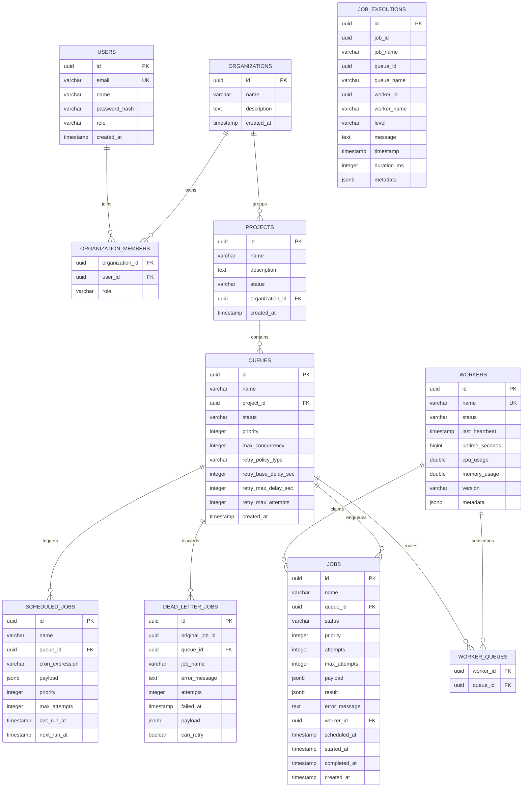

# Cronix Distributed Job Scheduler: System Architecture

This document describes the structural architecture, database schemas, and claiming mechanisms implemented in the Cronix project.

---

## Architecture Design Principles

Cronix follows **Clean Architecture** patterns, separating business logic from frameworks, UI, and databases.

```
       +---------------------------------------------+
       |                 Presentation                |
       |  (REST Controllers, DTOs, STOMP WebSockets) |
       +----------------------v----------------------+
                              |
       +----------------------v----------------------+
       |                  Application                |
       |       (Use Cases, Transactional Services)   |
       +----------------------v----------------------+
                              |
       +----------------------v----------------------+
       |                    Domain                   |
       |        (Pure Entities, Interface Ports)     |
       +---------------------------------------------+
                              ^
       +----------------------|----------------------+
       |                Infrastructure               |
       |  (Spring Data JPA, PostgreSQL, STOMP Broker)|
       +---------------------------------------------+
```

### Module Boundaries
1. **Domain**: Clean Java classes representing scheduler models (`Job`, `Queue`, `Worker`, `ScheduledJob`). It contains no frameworks, JPA annotations, or library dependencies (except Lombok).
2. **Application**: Contains the application logic, orchestrating DTO mappers and managing entities.
3. **Infrastructure**: Framework adapters. Includes Spring Security, JWT token parsers, PostgreSQL persistence entities, Redis caching, STOMP WebSocket configurations, and worker polling loops.
4. **Presentation**: Exposes API endpoints, handles request validation, handles global exception mapping, and manages STOMP routes.

---

## Database Schema (ER Diagram)

Below is the entity relationship model mapping organizations, projects, queues, jobs, and executions.



---

## Concurrency & Distributed Claiming

To prevent race conditions where multiple distributed worker threads claim the same job, Cronix uses PostgreSQL's native `FOR UPDATE SKIP LOCKED` transaction query.

### Sequence Flow of Atomic Claim

```mermaid
sequencePanel
    loop Every 1000ms
        WorkerPoller->>QueueRepository: Check Queue Concurrency (running < max)
        opt Concurrency OK
            WorkerPoller->>JobClaimer: claimJob(queueId, workerId)
            activate JobClaimer
            Note over JobClaimer: Start REQUIRES_NEW Transaction
            JobClaimer->>PostgreSQL: Query next queued job (FOR UPDATE SKIP LOCKED)
            alt Job Found
                PostgreSQL-->>JobClaimer: Return Job Row (Locked)
                JobClaimer->>PostgreSQL: UPDATE job set status='running', worker_id=workerId, started_at=now
                JobClaimer-->>WorkerPoller: Return claimed Job Details
                Note over JobClaimer: Commit Transaction & Release DB Lock
                deactivate JobClaimer
                WorkerPoller->>ThreadPool: Submit execution task asynchronously
                activate ThreadPool
                ThreadPool->>JobExecution: Run Simulated Workload
                ThreadPool->>PostgreSQL: UPDATE job set status='completed', completed_at=now
                ThreadPool->>PostgreSQL: INSERT INTO job_executions (Log)
                deactivate ThreadPool
            else No Job
                PostgreSQL-->>JobClaimer: Return empty
                Note over JobClaimer: Commit Transaction
                JobClaimer-->>WorkerPoller: Return empty
                deactivate JobClaimer
            end
        end
    end
```

### Advantages of this approach:
- **No external lock latency**: Avoids network hops to external distributed lock providers (like Zookeeper or Redis Redlock) for each claim operation.
- **Instant lock release**: By wrapping the query and status update in a short `REQUIRES_NEW` transaction, the lock on the row is held for less than a millisecond, freeing resources immediately while execution proceeds inside a thread pool.
- **Never blocks workers**: Using `SKIP LOCKED` ensures that if a row is currently being locked by another worker node, subsequent queries simply skip it and fetch the next item, avoiding lock wait queues.
